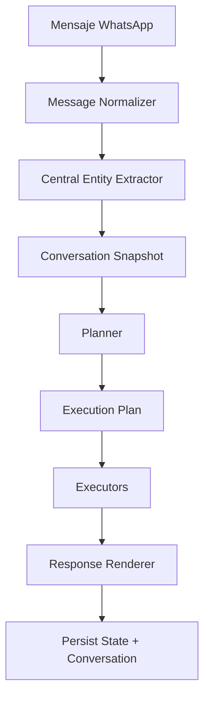
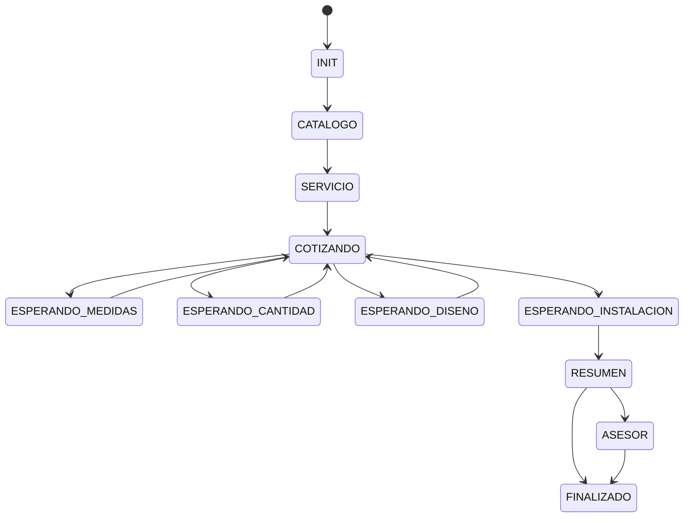

# ADR 2026-07-01: Planner como unica autoridad conversacional

## Estado

Propuesto. No aprobado para implementacion.

Este ADR existe para revision previa. La implementacion no debe comenzar hasta que la arquitectura sea aprobada explicitamente.

## Contexto

El motor conversacional actual de WhatsApp funciona, pero su arquitectura permite que varios modulos interpreten el mismo mensaje y tomen decisiones incompatibles. La auditoria inicial encontro decisiones repartidas en:

- `conversation-engine.service.js`: orquesta, pero tambien decide rutas de fallback, activa o desactiva autoridad del planner, interpreta `waitingField`, invoca reasoner, retrieval, decision engine y response planner.
- `conversation-router.js`: hace short-circuit deterministico, interpreta intencion, extrae entidades, selecciona servicio/categoria, calcula `waitingField`, crea `plannerDecision`, fabrica `responsePlan` y previsualiza estado.
- `commercial-conversation-planner.js`: ya intenta ser autoridad, pero aun depende de NLU previo, retrieval post-hoc, estado heredado, `waitingField`, heuristicas de tema y detectores laterales.
- `nlu.interpreter.js`: clasifica intencion y tipo, extrae presupuesto, servicio, producto, urgencia, problemas, catalogo, asesor y casos especificos de negocio.
- `commercial-reasoner.js`: decide objetivo comercial, accion recomendada, estrategia de retrieval y uso de memoria.
- `decision-engine.js`: decide accion final usando NLU, retrieval y estado.
- `direct-catalog-matcher.js`: selecciona servicio/categoria de forma directa.
- `response-planner.js`: ademas de planear respuesta, reinterpreta mensajes, selecciona servicios, revive memoria y decide preguntas siguientes.
- `conversation-state.manager.js`: guarda estado, pero tambien protege, revive o limpia memoria activa segun tipos de respuesta.
- `response-interpreter.js`, `missing-information.detector.js`, `topic-switch.detector.js`, `commercial-goal.detector.js` y `dimensions.parser.js`: contienen interpretacion contextual que hoy compite con NLU, router y planner.

El problema arquitectonico no se resuelve agregando mas condiciones. El sistema necesita una sola autoridad semantica y de estado.

## Decision

El Planner sera la unica autoridad conversacional.

Todo mensaje entrante seguira este flujo:



Regla principal:

El mensaje del cliente siempre se interpreta primero. El estado solo se consulta despues para decidir si el mensaje responde la pregunta anterior, cambia de tema, pide catalogo, pide categoria, pide servicio, pide asesor, pide recomendacion o requiere aclaracion.

Ningun modulo fuera del Planner podra cambiar intencion, servicio seleccionado, flujo activo, estado conversacional, `waitingField`, plan de respuesta ni handoff.

## Contrato Del Planner

El Planner recibira una entrada inmutable:

```js
{
  empresaId,
  conversationId,
  message: {
    raw,
    normalized,
    tokens
  },
  entities,
  stateSnapshot,
  catalogHints,
  companyConfig
}
```

El Planner devolvera un `ExecutionPlan` completo:

```js
{
  decisionId,
  intent,
  confidence,
  reason,
  stateBefore,
  stateAfter,
  nextState,
  entities,
  selectedService,
  selectedCategory,
  retrievalPlan,
  mcpPlan,
  responsePlan,
  persistencePlan,
  handoffPlan,
  logs
}
```

El `ExecutionPlan` sera la unica fuente de verdad para ejecutores, persistence, retrieval, MCP, respuesta y handoff.

## Preguntas Que Responde El Planner

El Planner debe evaluar el mensaje en este orden:

1. El usuario respondio exactamente la pregunta anterior?
2. El usuario cambio completamente de tema?
3. El usuario pidio catalogo?
4. El usuario pidio categoria?
5. El usuario pidio un servicio especifico?
6. El usuario pidio asesor?
7. El usuario pidio recomendacion?
8. Si nada coincide, cual es la pregunta aclaratoria minima?

Esta evaluacion se hace con el mensaje actual y las entidades actuales antes de usar memoria activa.

## Maquina De Estados

Cada conversacion tendra un unico estado conversacional:



`waitingField` desaparece como estado independiente. Si se mantiene temporalmente por compatibilidad, sera derivado de `stateAfter.nextState` y no podra guardarse como autoridad separada.

## Modulos Que Desaparecen

- `conversation-router.js`: se elimina como autoridad. Su responsabilidad actual se reemplaza por el Planner y por ejecutores sin interpretacion.
- `decision-engine.js`: se elimina. La accion final vive en `ExecutionPlan`.
- `commercial-reasoner.js`: se elimina como decisor. Sus conceptos utiles se migran a politicas internas del Planner.
- `direct-catalog-matcher.js`: se elimina como decisor independiente. Su logica util se reemplaza por `catalog-matcher` invocado por el Planner.
- `response-interpreter.js`: se elimina como modulo que decide respuestas por `waitingField`. Sus parsers utiles se migran al extractor central.
- Flags `NCIE_CONVERSATION_PLANNER_SHADOW` y fallback paralelo del planner: se eliminan al completar migracion. Durante migracion podran existir solo para pruebas, no como ruta productiva permanente.

## Modulos Que Se Conservan

- `message-normalizer.js`: conserva normalizacion de texto.
- `retrieval.service.js`: conserva recuperacion de catalogo, servicios, productos y categorias, pero no decide seleccion ni accion.
- `mcpClient.js` y herramientas MCP: conservan ejecucion de herramientas. MCP recomienda o consulta, pero no cambia flujo.
- `response-generator.js`: conserva renderizado final, pero solo renderiza el `responsePlan` recibido.
- `conversation-state.manager.js`: conserva persistencia y lectura, pero deja de corregir o revivir seleccion activa por cuenta propia.
- `advisor-notification.js`: conserva construccion/envio de notificacion, pero solo si `ExecutionPlan.handoffPlan` lo indica.
- `conversation-engine.service.js`: conserva orquestacion de alto nivel, sin decisiones semanticas.

## Modulos Que Cambian De Responsabilidad

### `conversation-engine.service.js`

Nueva responsabilidad:

- Normalizar mensaje.
- Cargar snapshot.
- Cargar datos auxiliares minimos.
- Invocar extractor central.
- Invocar Planner.
- Ejecutar `ExecutionPlan`.
- Persistir resultado.
- Registrar logs canonicos.

No puede:

- Interpretar `waitingField`.
- Decidir usar memoria.
- Decidir retrieval.
- Crear decisiones alternativas.
- Hacer fallback semantico.

### `commercial-conversation-planner.js`

Nueva responsabilidad:

- Convertirse en el unico Planner.
- Recibir entidades centralizadas.
- Evaluar cambio de tema, respuesta a pregunta anterior, catalogo, categoria, servicio, asesor y recomendacion.
- Producir `ExecutionPlan`.
- Producir `stateAfter`.

No puede:

- Depender de decisiones previas de router, reasoner o decision engine.
- Leer active memory como verdad.
- Elegir estado por `waitingField` heredado sin validar primero el mensaje actual.

### `conversation-state.manager.js`

Nueva responsabilidad:

- Leer `ConversationSnapshot`.
- Guardar exactamente `stateAfter` indicado por el Planner.
- Mantener historial y compatibilidad legacy.

No puede:

- Revivir `selectedService`.
- Proteger flujos salvo validaciones estructurales.
- Inferir `waitingField`.
- Cambiar `activeFlow`.

### `retrieval.service.js`

Nueva responsabilidad:

- Ejecutar `retrievalPlan`.
- Devolver candidatos y evidencia.
- Hidratar servicios/productos por ID.

No puede:

- Seleccionar servicio final.
- Cambiar categoria activa.
- Decidir si hay que preguntar o cotizar.

### `response-planner.js`

Nueva responsabilidad:

- Desaparece como planner conversacional o se renombra a `response-template.builder.js`.
- Construye plantillas a partir de `ExecutionPlan.responsePlan`.

No puede:

- Reinterpretar mensaje.
- Usar `state.lastService` para continuar flujo.
- Elegir siguiente pregunta.

### `nlu.interpreter.js`

Nueva responsabilidad:

- Se reemplaza por `entity-extractor`.
- Puede conservarse temporalmente como adaptador, pero sin decidir intencion final.

## Nuevos Modulos

### `entity-extractor`

Extrae en un solo paso:

- cantidad
- medidas
- presupuesto
- servicio
- categoria
- diseno
- instalacion
- objetivo
- ubicacion
- prioridad
- solicitud de asesor
- solicitud de catalogo
- solicitud de recomendacion
- saludo, agradecimiento y mensajes neutrales

Cada entidad debe incluir:

```js
{
  value,
  confidence,
  source,
  evidence
}
```

El extractor no decide que hacer con la entidad. Por ejemplo, `1000` puede extraerse como numero ambiguo y como presupuesto probable si hay evidencia monetaria, pero el Planner decide como usarlo segun mensaje y estado.

### `catalog-matcher`

Matcher hibrido usado solo por el Planner:

- sinonimos configurables por empresa
- normalizacion
- singular/plural
- errores ortograficos
- ranking textual
- embeddings si estan disponibles

Devuelve candidatos con score y evidencia. No selecciona el servicio final por si mismo.

### `execution-plan.executor`

Ejecuta instrucciones:

- retrieval
- MCP
- handoff
- persistencia
- rendering
- lead creation

No interpreta mensajes.

## Active Memory

Active memory deja de ser autoridad.

Se conserva solo como historial enriquecedor:

- ultimo servicio consultado
- ultima categoria consultada
- ultimo presupuesto mencionado
- ultimo resumen enviado
- historial corto de mensajes y preguntas

No puede determinar:

- servicio actual
- flujo actual
- siguiente pregunta
- campo esperado
- cambio de tema

El estado activo vive solo en la maquina de estados del Planner.

## Cambio De Tema

Si el mensaje actual contiene una nueva solicitud especifica incompatible con el flujo activo, el Planner debe:

- cerrar el flujo anterior con `closeReason: "topic_switch"`
- limpiar seleccion activa
- crear un flujo nuevo
- registrar razon y confianza
- nunca mezclar entidades del flujo anterior con el nuevo

Ejemplo:

`quiero lona` -> `medidas` -> `presupuesto` -> `mejor diseno web`

El Planner debe cerrar lona y abrir diseno web.

## Preguntas Repetidas

El estado debe guardar:

- `lastQuestionId`
- `lastQuestionText`
- `questionHistory`

Si el Planner elige la misma pregunta logica dos veces seguidas, el renderer debe usar una variante permitida o el Planner debe elegir una pregunta de reparacion.

## Logs Canonicos

Cada mensaje debe emitir logs claros:

- `planner_input`
- `planner_entities`
- `planner_state_before`
- `planner_decision`
- `planner_confidence`
- `planner_reason`
- `planner_next_state`
- `planner_execution_plan`
- `planner_state_after`

Se deben retirar logs ambiguos que sugieran multiples autoridades, como decisiones independientes de router, reasoner o matcher.

## Flujo End To End

1. WhatsApp recibe mensaje.
2. `messageOrchestrator` llama al motor conversacional.
3. `conversation-engine.service.js` normaliza mensaje.
4. Carga `ConversationSnapshot` desde `conversation-state.manager.js`.
5. `entity-extractor` extrae entidades con confianza.
6. El Planner recibe mensaje, entidades y snapshot.
7. Si necesita informacion, el Planner emite `retrievalPlan`.
8. El ejecutor corre retrieval/MCP y devuelve evidencia.
9. El Planner finaliza `ExecutionPlan` con `stateAfter` y `responsePlan`.
10. Ejecutores hacen handoff, lead, respuesta y persistencia segun plan.
11. `response-generator.js` renderiza sin decidir.
12. `conversation-state.manager.js` guarda `stateAfter`.
13. WhatsApp envia respuesta.

## Estrategia De Migracion

### Fase 1: Contratos y pruebas de arquitectura

- Definir tipos de `EntityExtractionResult`, `ConversationSnapshot`, `PlannerDecision`, `ExecutionPlan` y estados canonicos.
- Agregar pruebas de contrato que fallen si router, matcher, retrieval, memory o response planner cambian estado por fuera del Planner.
- Congelar los sintomas actuales como casos de regresion.

### Fase 2: Extractor central

- Crear `entity-extractor`.
- Migrar parsers utiles de `nlu.interpreter.js`, `response-interpreter.js`, `dimensions.parser.js` y detectores de preferencias.
- Eliminar regex duplicadas desde rutas productivas.

### Fase 3: Planner unico

- Reescribir `commercial-conversation-planner.js` para producir `ExecutionPlan`.
- Mover seleccion de servicio/categoria al Planner usando `catalog-matcher`.
- Mover cambio de tema y respuesta a pregunta anterior al Planner.

### Fase 4: Ejecutores tontos

- Reducir `conversation-engine.service.js` a orquestador.
- Convertir `retrieval.service.js`, MCP, handoff y response generator en ejecutores.
- Eliminar `decision-engine.js`, `commercial-reasoner.js`, `conversation-router.js` y `direct-catalog-matcher.js` como rutas productivas.

### Fase 5: Persistencia canonica

- Guardar un unico estado conversacional.
- Derivar `waitingField` de estado solo para compatibilidad temporal.
- Dejar active memory como historial, no como decision.

### Fase 6: Limpieza y canary

- Retirar flags de shadow/fallback.
- Retirar logs de autoridades viejas.
- Ejecutar pruebas de regresion y dataset real.
- Activar por empresa con rollback tecnico solo a nivel de version de engine, no con autoridades paralelas.

## Criterios De Aceptacion

- Un mensaje produce exactamente un `ExecutionPlan`.
- Solo el Planner puede elegir `intent`, `selectedService`, `nextState`, `responsePlan` y `handoffPlan`.
- `waitingField` no existe como estado independiente.
- `activeMemory` no revive servicios ni flujos.
- `retrieval` devuelve evidencia, no decisiones.
- `MCP` recomienda o consulta, no cambia flujo.
- El sistema no repite exactamente la misma pregunta.
- Numeros ambiguos se clasifican con entidades y confianza, no por contexto heredado ciego.
- Cambios de tema cierran el flujo anterior antes de abrir uno nuevo.
- Los logs muestran una sola decision canonica por mensaje.
- El comportamiento no depende de MOK Estudio ni de una empresa especifica.

## Consecuencias

Beneficios:

- Menos contradicciones entre modulos.
- Flujo auditable por mensaje.
- Estado conversacional unico.
- Mejor soporte multiempresa.
- Pruebas mas simples porque hay una sola decision canonica.

Costos:

- Refactor grande y riesgoso.
- Requiere migrar tests existentes.
- Puede romper casos cubiertos por heuristicas antiguas.
- Necesita validacion por dataset real antes de activar por defecto.

## Decision Pendiente

Se requiere aprobacion antes de implementar:

- Aprobar esta arquitectura tal cual.
- Aprobarla con cambios especificos.
- Rechazarla y proponer otro modelo.

Hasta recibir aprobacion, no se deben modificar archivos de implementacion.
